<div align="center">


**Unified Agent & MCP Server Registry – Gateway for AI Development Tools**

[](https://github.com/agentic-community/mcp-gateway-registry/stargazers)
[](https://github.com/agentic-community/mcp-gateway-registry/network)
[](https://github.com/agentic-community/mcp-gateway-registry/issues)
[](https://github.com/agentic-community/mcp-gateway-registry/blob/main/LICENSE)
[](https://github.com/agentic-community/mcp-gateway-registry/releases)

[🚀 Get Running Now](#option-a-pre-built-images-instant-setup) | [macOS Setup Skill](.claude/skills/macos-setup/SKILL.md) | [AWS Workshop Studio](https://catalog.us-east-1.prod.workshops.aws/workshops/0c3265a6-1a4a-467b-ae56-e4d019184b0e/en-US) | [AWS Deployment](terraform/aws-ecs/README.md) | [Quick Start](#quick-start) | [Documentation](docs/) | [Community](#community)

**Demo Videos:** 🎥 [AWS Show & Tell](https://www.youtube.com/watch?v=dk0qVukHLGU) | ⭐ [MCP Registry CLI Demo](https://github.com/user-attachments/assets/98200866-e8bd-4ac3-bad6-c6d42b261dbe) | [Full End-to-End Functionality](https://github.com/user-attachments/assets/5ffd8e81-8885-4412-a4d4-3339bbdba4fb) | [OAuth 3-Legged Authentication](https://github.com/user-attachments/assets/3c3a570b-29e6-4dd3-b213-4175884396cc) | [Dynamic Tool Discovery](https://github.com/user-attachments/assets/cee25b31-61e4-4089-918c-c3757f84518c) | [Agent Skills](https://github.com/user-attachments/assets/5d1f227a-25f8-480d-9ff9-acba2498844b) | [Virtual MCP Servers](https://app.vidcast.io/share/954e6296-f217-4559-8d86-88cec25af763)

</div>

---

## What is MCP Gateway & Registry?

The **MCP Gateway & Registry** is a unified platform designed for centralizing access to both MCP Servers and AI Agents using the [Model Context Protocol (MCP)](https://modelcontextprotocol.io/introduction). It serves three core functions:

1. **Unified MCP Server Gateway** – Centralized access point for multiple MCP servers
2. **MCP Servers Registry** – Register, discover, and manage access to MCP servers with unified governance
3. **Agent Registry & A2A Communication Hub** – Agent registration, discovery, governance, and direct agent-to-agent communication through the [A2A (Agent-to-Agent) Protocol](https://a2a-protocol.org/latest/specification/)

The platform integrates with external registries such as Anthropic's MCP Registry (and more to come), providing a single control plane for both tool access, agent orchestration, and agent-to-agent communication patterns.

**Why unified?** Instead of managing hundreds of individual MCP server configurations, agent connections, and separate governance systems across your development teams, this platform provides secure, governed access to curated MCP servers and registered agents through a single, unified control plane.

**Transform this chaos:**
```
❌ AI agents require separate connections to each MCP server
❌ Each developer configures VS Code, Cursor, Claude Code individually
❌ Developers must install and manage MCP servers locally
❌ No standard authentication flow for enterprise tools
❌ Scattered API keys and credentials across tools
❌ No visibility into what tools teams are using
❌ Security risks from unmanaged tool sprawl
❌ No dynamic tool discovery for autonomous agents
❌ No curated tool catalog for multi-tenant environments
❌ A2A provides agent cards but no way for agents to discover other agents
❌ Maintaining separate MCP server and agent registries is a non-starter for governance
❌ Impossible to maintain unified policies across server and agent access
```

**Into this organized approach:**
```
✅ AI agents connect to one gateway, access multiple MCP servers
✅ Single configuration point for VS Code, Cursor, Claude Code
✅ Central IT manages cloud-hosted MCP infrastructure via streamable HTTP
✅ Developers use standard OAuth 2LO/3LO flows for enterprise MCP servers
✅ Centralized credential management with secure vault integration
✅ Complete visibility and audit trail for all tool usage
✅ Security features with governed tool access
✅ Dynamic tool discovery and invocation for autonomous workflows
✅ Registry provides discoverable, curated MCP servers for multi-tenant use
✅ Agents can discover and communicate with other agents through unified Agent Registry
✅ Single control plane for both MCP servers and agent governance
✅ Unified policies and audit trails for both server and agent access
```

```
┌─────────────────────────────────────┐     ┌──────────────────────────────────────────────────────┐
│          BEFORE: Chaos              │     │    AFTER: MCP Gateway & Registry                     │
├─────────────────────────────────────┤     ├──────────────────────────────────────────────────────┤
│                                     │     │                                                      │
│  Developer 1 ──┬──► MCP Server A    │     │  Developer 1 ──┐                  ┌─ MCP Server A    │
│                ├──► MCP Server B    │     │                │                  ├─ MCP Server B    │
│                └──► MCP Server C    │     │  Developer 2 ──┼──► MCP Gateway   │                  │
│                                     │     │                │    & Registry ───┼─ MCP Server C    │
│  Developer 2 ──┬──► MCP Server A    │ ──► │  AI Agent 1 ───┘         │        │                  │
│                ├──► MCP Server D    │     │                          │        ├─ AI Agent 1      │
│                └──► MCP Server E    │     │  AI Agent 2 ──────────────┤        ├─ AI Agent 2     │
│                                     │     │                          │        │                  │
│  AI Agent 1 ───┬──► MCP Server B    │     │  AI Agent 3 ──────────────┘        └─ AI Agent 3     │
│                ├──► MCP Server C    │     │                                                      │
│                └──► MCP Server F    │     │              Single Connection Point                 │
│                                     │     │                                                      │
│  ❌ Multiple connections per user  │     │         ✅ One gateway for all                      │
│  ❌ No centralized control         │     │         ✅ Unified server & agent access            │
│  ❌ Credential sprawl              │     │         ✅ Unified governance & audit trails        │
└─────────────────────────────────────┘     └──────────────────────────────────────────────────────┘
```

> **Note on Agent-to-Agent Communication:** AI Agents discover other AI Agents through the unified Agent Registry and communicate with them **directly** (peer-to-peer) without routing through the MCP Gateway. The Registry handles discovery, authentication, and access control, while agents maintain direct connections for efficient, low-latency communication.

## Unified Agent & Server Registry

This platform serves as a comprehensive, unified registry supporting:

- ✅ **MCP Server Registration & Discovery** – Register, discover, and manage access to MCP servers
- ✅ **AI Agent Registration & Discovery** – Register agents and enable them to discover other agents
- ✅ **Agent-to-Agent (A2A) Communication** – Direct agent-to-agent communication patterns using the A2A protocol
- ✅ **Multi-Protocol Support** – Support for various agent communication protocols and patterns
- ✅ **Unified Governance** – Single policy and access control system for both agents and servers
- ✅ **Cross-Protocol Agent Discovery** – Agents can discover each other regardless of implementation
- ✅ **Integrated External Registries** – Connect with Anthropic's MCP Registry and other external sources
- ✅ **Agent Cards & Metadata** – Rich metadata for agent capabilities, skills, and authentication schemes

Key distinction: **Unlike separate point solutions, this unified registry eliminates the need to maintain separate MCP server and agent systems**, providing a single control plane for agent orchestration, MCP server access, and agent-to-agent communication.

## MCP Servers & Agents Registry

Watch how MCP Servers, A2A Agents, and External Registries work together for dynamic tool discovery:

https://github.com/user-attachments/assets/f539f784-17f5-4658-99b3-d664bd5cecaa

---

## MCP Tools in Action

[View MCP Tools Demo](docs/img/MCP_tools.gif)

---

## MCP Registry CLI

Interactive terminal interface for chatting with AI models and discovering MCP tools in natural language. Talk to the registry using a Claude Code-like conversational interface with real-time token status, cost tracking, and AI model selection.

<div align="center">

</div>

**Quick Start:** `registry --url https://mcpgateway.ddns.net` | [Full Guide](docs/mcp-registry-cli.md)

---

## What's New

- **Amazon Bedrock AgentCore Bulk Import** - Auto-discover and register all AgentCore Gateways and Agent Runtimes from your AWS account in a single command. The CLI scans for READY resources, registers gateways as MCP Servers and runtimes as MCP Servers or A2A Agents based on protocol, and writes a token refresh manifest for automated credential rotation. Supports multi-account scanning, OIDC-compliant identity providers (Cognito, Auth0, Okta, Entra ID, Keycloak), and overwrite mode for updating existing registrations. [AgentCore Operations Guide](docs/agentcore.md) | [Design Document](docs/design/agentcore-scanner-design.md)

- **Anonymous Usage Telemetry** - Privacy-first telemetry to track registry adoption patterns. Sends only non-sensitive deployment metadata (version, OS, storage backend, auth provider) -- no PII, no hostnames, no user data. Opt-out by default (startup ping is ON, set `MCP_TELEMETRY_DISABLED=1` to disable). Opt-in daily heartbeat with aggregate counts (server/agent/skill totals). HMAC-signed requests, IP-hashed rate limiting, strict schema validation, and fail-silent design ensure zero impact on registry operation. Admin API to force heartbeat/startup events on demand. [Telemetry Documentation](docs/TELEMETRY.md)

- **Agent Name Service (ANS) Integration** - Adds PKI-based trust verification for registered agents and MCP servers through GoDaddy's [Agent Name Service](https://www.godaddy.com/ans). Agent owners link their ANS Agent ID to their registry entry, and the registry verifies the identity via the ANS API, displaying a clickable trust badge on agent cards and semantic search results. A background scheduler re-verifies all linked identities every 6 hours with circuit breaker protection. Supports verified, expired, and revoked status tracking with admin endpoints for manual sync, metrics, and health checks. [Design and Operations Guide](docs/design/ans-integration.md) | [Demo Video](https://app.vidcast.io/share/c2240a78-8899-46ad-9375-6fb0cc1345f3?playerMode=vidcast)

- **Registry Card for Federation Discovery** - As registries increasingly need to discover and communicate with each other, we've implemented the Registry Card specification—a standardized discovery document accessible via `/.well-known/registry-card`. This provides essential metadata including authentication endpoints, capabilities, and contact information for any registry instance. Enhanced server, agent, and skills cards with richer metadata enable better federation workflows. [Registry Card Configuration Guide](docs/federation-operational-guide.md#registry-card-configuration)

- 🔑 **Auth0 Identity Provider Support** - Full enterprise SSO integration with Auth0 as an identity provider. The harmonized IAM API now supports Auth0 alongside Keycloak, Microsoft Entra ID, and Okta, providing a unified interface to create users, groups, and M2M service accounts regardless of your IdP choice. Features include Auth0 Actions for group claims injection, M2M client sync with database-driven groups enrichment for OAuth2 Client Credentials tokens, and complete Docker Compose and Terraform/ECS deployment support. Switch identity providers with a single environment variable while using the same management APIs and UI. [Auth0 Setup Guide](docs/auth0.md)

- 🔑 **Okta Identity Provider Support** - Full enterprise SSO integration with Okta as an identity provider. The existing harmonized IAM API now supports Okta alongside Keycloak and Microsoft Entra ID, providing a unified interface to create users, groups, and M2M service accounts regardless of your IdP choice. Features include custom authorization server support for scalable M2M authentication, database-driven groups enrichment for OAuth2 Client Credentials tokens, and complete Docker Compose and Terraform/ECS deployment support. Switch identity providers with a single environment variable while using the same management APIs and UI. [Okta Setup Guide](docs/okta-setup.md)

- 🔐 **Enterprise Security Posture Documentation** - Comprehensive security architecture documentation covering defense-in-depth across all deployment platforms (ECS, EKS, Docker Compose). Details infrastructure security, encryption at rest/in-transit with KMS, secrets management with automated rotation, container hardening following CIS benchmarks, application security with automated scanning (Semgrep, Bandit), supply chain security for MCP servers, and compliance with SOC 2/GDPR standards. [Security Posture Guide](docs/security-posture.md)

- **📊 Direct OTLP Push Export for Metrics** - Push metrics directly to any OTLP-compatible observability platform (Datadog, New Relic, Honeycomb, Grafana Cloud) without requiring an intermediate OTEL Collector. Configure via environment variables (`OTEL_OTLP_ENDPOINT`, `OTEL_EXPORTER_OTLP_HEADERS`) for instant integration with commercial observability platforms. Supports both Docker Compose and Terraform/ECS deployments with secure credential handling via AWS Secrets Manager. Works alongside existing Prometheus/Grafana setup for hybrid monitoring. [Metrics Architecture Guide - Direct OTLP Push](docs/metrics-architecture.md#direct-otlp-push-export-simplified-setup)

- ⭐ **AWS Workshop Studio: Securing AI Agent Ecosystems with MCP Gateway and Registry** - Hands-on workshop covering deployment, authentication, governance, and security best practices for production AI agent ecosystems. Learn to deploy the MCP Gateway & Registry on AWS, configure enterprise authentication, implement fine-grained access control, and secure AI agent communications. [Start Workshop](https://catalog.us-east-1.prod.workshops.aws/workshops/0c3265a6-1a4a-467b-ae56-e4d019184b0e/en-US)

- 💻 **One-Command macOS Setup** - The quickest way to get started and experiment with the solution on your MacBook. Simply ask Claude Code or your favorite AI coding assistant to use the [macOS Setup Skill](.claude/skills/macos-setup/SKILL.md) and it will automatically clone the repository, install all dependencies, configure services (MongoDB, Keycloak, registry), register sample servers, and verify the complete stack is running. Perfect for single-developer environments and hands-on exploration. Supports both full setup and complete teardown with a single command. *ECS/EKS deployment skill coming very soon.*

- **AI Registry MCP Server (airegistry-tools)** - Enables AI coding assistants (Claude Code, Roo Code, Cursor, etc.) to discover and query MCP servers, agents, and skills directly from the registry. Provides 5 tools: `list_services`, `list_agents`, `list_skills`, `intelligent_tool_finder` (semantic search), and `healthcheck`. Auto-registered on registry startup with no manual setup required. See [AI Registry Tools documentation](docs/ai-registry-tools.md) for details.

- **Governance & Security Enhancements** - Enhanced audit logging with searchable filters (username, MCP server) and statistics dashboard showing top users, operations, timeline charts, and per-user activity breakdowns. System uptime and health stats now visible in the header with deployment info, registry statistics, and database status. Comprehensive security hardening via Bandit scanning addressed subprocess security (B603/B607), SQL injection prevention (B608), hardcoded credentials detection (B105), and other vulnerability patterns across the codebase. All security findings documented and resolved with proper justifications for necessary exceptions.

- **IAM Settings UI** - Visual interface for managing users, groups, and M2M service accounts directly from the web UI. Create and configure access control groups with fine-grained permissions for servers, tools, agents, and UI features. Manage human users with group assignments, and create M2M service accounts for AI agents with OAuth2 client credentials. Features include searchable server/agent/tool selectors, JSON import/export for scope configurations, and support for both MCP servers and virtual servers in access rules. Works with both Keycloak and Microsoft Entra ID identity providers. [IAM Settings Guide](docs/iam-settings-ui.md)

- **System Configuration Viewer** - View and export all registry configuration parameters through the Settings UI. Admin-only panel displays 11 configuration groups (Deployment, Storage, Auth, Embeddings, Health, WebSocket, Security Scanning, Audit, Federation, Discovery) with sensitive value masking. Export configuration in ENV, JSON, TFVARS, or YAML formats for deployment automation. API endpoints provide programmatic access at `/api/config/full` and `/api/config/export`. [Configuration Guide](docs/configuration.md#viewing-configuration-via-ui)

- **Virtual MCP Server Support** - Aggregate tools, resources, and prompts from multiple backend MCP servers into a single unified endpoint. Clients connect to one virtual server that presents a curated, access-controlled view of capabilities from any combination of registered backends. Features include tool aliasing (resolve naming conflicts), version pinning (lock to specific backend versions), per-tool scope-based access control, session multiplexing (one client session maps to N backend sessions transparently), and 60-second cached aggregation for `tools/list`, `resources/list`, and `prompts/list`. Supports all MCP JSON-RPC methods including `initialize`, `ping`, `tools/call`, `resources/read`, and `prompts/get`. [Design Document](docs/design/virtual-mcp-server.md) | [Operations Guide](docs/virtual-server-operations.md)

- **Registry-Only Deployment Mode** - Run the registry as a standalone catalog/discovery service without nginx gateway integration. In `registry-only` mode, nginx configuration is not updated when servers are registered, and MCP proxy requests return 503 with instructions to use direct connection. The frontend adapts to show `proxy_pass_url` instead of gateway URLs. Combined with `REGISTRY_MODE` settings (`full`, `skills-only`, `mcp-servers-only`, `agents-only`), you can configure the registry for specific use cases. For example, set `REGISTRY_MODE=skills-only` to run a dedicated Skills Registry that only manages Agent Skills (SKILL.md files) without MCP servers or A2A agents - ideal for teams that want a lightweight skill library. The UI automatically adapts to show only relevant features, and API endpoints for disabled features return 503. Invalid combinations like `with-gateway + skills-only` are auto-corrected with warnings. [Registry Deployment Modes Guide](docs/registry-deployment-modes.md)

- **Agent Skills Registry** - Register, discover, and manage reusable instruction sets (SKILL.md files) that enhance AI coding assistants with specialized workflows. Skills are hosted on GitHub, GitLab, or Bitbucket and registered in the MCP Gateway Registry for discovery and access control. Features include YAML frontmatter parsing for metadata extraction, health monitoring with URL accessibility checks, visibility controls (public/private/group), star ratings, semantic search integration, tool dependency validation, and a rich UI with SKILL.md content modals. Security includes automatic security scanning during registration using [Cisco AI Defense Skill Scanner](https://github.com/cisco-ai-defense/cisco-ai-skill-scanner) with YARA pattern matching, LLM analysis, and static code inspection. SSRF protection with redirect validation ensures safe URL handling. [Agent Skills Guide](docs/agent-skills-operational-guide.md) | [Architecture](docs/design/agent-skills-architecture.md) | [Security Scanning](docs/security-scanner.md#agent-skills-security-scanning)

- **📋 Compliance Audit Logging** - Comprehensive audit logging for security monitoring and compliance. Captures all Registry API and MCP Gateway access events with user identity, operation details, and timing. Features include automatic credential masking (tokens, cookies, passwords are never logged), TTL-based log retention (default 7 days, configurable), admin-only audit viewer UI with filtering and export (JSONL/CSV), and non-blocking async design. Supports SOC 2 and GDPR requirements with who/what/when/where/outcome tracking. [Audit Logging Guide](docs/audit-logging.md)

- **🌐 Peer-to-Peer Registry Federation** - Connect multiple MCP Gateway Registry instances for bidirectional server and agent synchronization. Central IT teams can aggregate visibility across Line of Business registries, or LOBs can inherit shared tools from a central hub. Features include configurable sync modes (all, whitelist, tag filter), scheduled and on-demand sync, static token authentication for IdP-agnostic deployments, Fernet-encrypted credential storage, generation-based orphan detection, and path namespacing to prevent collisions. Synced items are read-only and display their source registry. A VS Code-style Settings UI provides peer management, sync triggering, and status monitoring. [Architecture Design](docs/design/federation-architecture.md) | [Operational Guide](docs/federation-operational-guide.md)

- **🔑 Static Token Auth for Registry API** - Access Registry API endpoints (`/api/*`, `/v0.1/*`) using a static API key instead of IdP-based JWT validation. Designed for trusted network environments, CI/CD pipelines, and CLI tooling where configuring a full identity provider may not be practical. MCP Gateway endpoints continue to require full IdP authentication. Includes startup validation that disables the feature if no token is configured. [Static Token Auth Guide](docs/static-token-auth.md)

- **🔀 MCP Server Version Routing** - Run multiple versions of the same MCP server simultaneously behind a single gateway endpoint. Register new versions as inactive, test them with the `X-MCP-Server-Version` header, then promote to active with a single API call or UI click. Features include instant rollback, version pinning for clients, deprecation lifecycle with sunset dates, automatic nginx map-based O(1) routing, cascade deletion of all versions, and post-swap health checks. The dashboard displays both the admin-controlled routing version and the MCP server-reported software version independently. Only the active version appears in search results and health checks. [Design Document](docs/design/server-versioning.md) | [Operations Guide](docs/server-versioning-operations.md)
- **👥 Multi-Provider IAM with Harmonized API** - Full Identity and Access Management support for Keycloak, Microsoft Entra ID, Okta, and Auth0. The registry API provides a unified experience for user and group management regardless of which IdP you use. Human users can log in via the UI and generate self-signed JWT tokens (with the same permissions as their session) for CLI tools and AI coding assistants. Service accounts (M2M) enable AI agent identity with OAuth2 Client Credentials flow. Fine-grained access control through scopes defines exactly which MCP servers, methods, tools, and agents each user can access. [Authentication Design](docs/design/authentication-design.md) | [IdP Provider Architecture](docs/design/idp-provider-support.md) | [Scopes Management](docs/scopes-mgmt.md) | [Entra ID Setup](docs/entra-id-setup.md) | [Okta Setup](docs/okta-setup.md) | [Auth0 Setup](docs/auth0.md)
- **🏷️ Custom Metadata for Servers & Agents** - Add rich custom metadata to MCP servers and agents for organization, compliance, and integration tracking. Metadata is fully searchable via semantic search, enabling queries like "team:data-platform", "PCI-DSS compliant", or "owner:alice@example.com". Use cases include team ownership, compliance tracking (PCI-DSS, HIPAA), cost center allocation, deployment regions, JIRA tickets, and custom tags. Backward compatible with existing registrations. [Metadata Usage Guide](docs/custom-metadata.md)
- **🔎 Enhanced Hybrid Search** - Improved semantic search combining vector similarity with tokenized keyword matching for servers, tools, and agents. Explicit name references now boost relevance scores, ensuring exact matches appear first. [Hybrid Search Architecture](docs/design/hybrid-search-architecture.md)
- **🛡️ Security Scan Results in UI** - Security scan results are now displayed directly on Server and Agent cards with color-coded shield icons (gray/green/red). Click the shield icon to view detailed scan results and trigger rescans from the UI. [Security Scanner Documentation](docs/security-scanner.md)
- **🧪 Comprehensive Test Suite & Updated LLM Documentation** - Full pytest test suite with 701+ passing tests (unit, integration, E2E) running automatically on all PRs via GitHub Actions. 35% minimum coverage (targeting 80%), ~30 second execution with 8 parallel workers. Updated llms.txt provides comprehensive documentation for LLM coding assistants covering storage backend migration (file → DocumentDB/MongoDB), repository patterns, AWS ECS deployment, Microsoft Entra ID integration, dual security scanning, federation architecture, rating system, testing standards, and critical code organization antipatterns. [Testing Guide](docs/testing/README.md) | [docs/llms.txt](docs/llms.txt)
- **📊 DocumentDB & MongoDB CE Storage Backend** - Distributed storage with MongoDB-compatible backends. DocumentDB provides native HNSW vector search for sub-100ms semantic queries in production deployments, while MongoDB Community Edition 8.2 enables full-featured local development with replica sets. Both backends use the same repository abstraction layer with automatic collection management, optimized indexes, and application-level vector search for MongoDB CE. Switch between MongoDB CE (local testing) and DocumentDB (production) with a single environment variable. Note: File-based storage is deprecated and will be removed in a future release. MongoDB CE is recommended for local development. [Configuration Guide](docs/configuration.md#storage-backend-configuration) | [Storage Architecture](docs/design/storage-architecture-mongodb-documentdb.md)
- **🔒 A2A Agent Security Scanning** - Integrated security scanning for A2A agents using [Cisco AI Defense A2A Scanner](https://github.com/cisco-ai-defense/a2a-scanner). Automatic security scans during agent registration with YARA pattern matching, A2A specification validation, and heuristic threat detection. Features include automatic tagging of unsafe agents, configurable blocking policies, and detailed scan reports with API endpoints for viewing results and triggering rescans.
- **🔧 Registry Management API** - New programmatic API for managing servers, groups, and users. Python client (`api/registry_client.py`) with type-safe interfaces, RESTful HTTP endpoints (`/api/management/*`), and comprehensive error handling. Replaces shell scripts with modern API approach while maintaining backward compatibility. [API Documentation](api/README.md) | [Service Management Guide](docs/service-management.md)
- **⭐ Server & Agent Rating System** - Rate and review agents with an interactive 5-star rating widget. Users can submit ratings via the UI or CLI, view aggregate ratings with individual rating details, and update their existing ratings. Features include a rotating buffer (max 100 ratings per agent), one rating per user, float average calculations, and full OpenAPI documentation. Enables community-driven agent quality assessment and discovery.
- **🧠 Flexible Embeddings Support** - Choose from three embedding provider options for semantic search: local sentence-transformers, OpenAI, or any LiteLLM-supported provider including Amazon Bedrock Titan, Cohere, and 100+ other models. Switch providers with simple configuration changes. [Embeddings Guide](docs/embeddings.md)
- **☁️ AWS ECS Deployment** - Deployment configuration on Amazon ECS Fargate with multi-AZ architecture, Application Load Balancer with HTTPS, auto-scaling, CloudWatch monitoring, and NAT Gateway redundancy. Complete Terraform configuration for deploying the entire stack. [ECS Deployment Guide](terraform/aws-ecs/README.md)
- **📦 Flexible Deployment Modes** - Three deployment options to match your requirements: (1) CloudFront Only for quick setup without custom domains, (2) Custom Domain with Route53/ACM for branded URLs, or (3) CloudFront + Custom Domain for production with CDN benefits. [Deployment Modes Guide](docs/deployment-modes.md)
- **🔗 Federated Registry** - MCP Gateway registry now supports federation of servers and agents from other registries. [Federation Guide](docs/federation.md)
- **🔗 Agent-to-Agent (A2A) Protocol Support** - Agents can now register, discover, and communicate with other agents through a secure, centralized registry. Enable autonomous agent ecosystems with Keycloak-based access control and fine-grained permissions. [A2A Guide](docs/a2a.md)
- **🏢 Microsoft Entra ID Integration** - Enterprise SSO with Microsoft Entra ID (Azure AD) authentication. Group-based access control, conditional access policies, and seamless integration with existing Microsoft 365 environments. [Entra ID Setup Guide](docs/entra-id-setup.md)
- **🤖 Agentic CLI for MCP Registry** - Talk to the Registry in natural language using a Claude Code-like interface. Discover tools, ask questions, and execute MCP commands conversationally. [Learn more](docs/mcp-registry-cli.md)
- **🔒 MCP Server Security Scanning** - Integrated vulnerability scanning with [Cisco AI Defense MCP Scanner](https://github.com/cisco-ai-defense/mcp-scanner). Automatic security scans during server registration, periodic registry-wide scans with detailed markdown reports, and automatic disabling of servers with security issues.
- **📥 Import Servers from Anthropic MCP Registry** - Import curated MCP servers from Anthropic's registry with a single command. [Import Guide](docs/anthropic-registry-import.md)
- **🔌 Anthropic MCP Registry REST API Compatibility** - Full compatibility with Anthropic's MCP Registry REST API specification. [API Documentation](docs/anthropic_registry_api.md)
- **🔎 Unified Semantic Search for Servers, Tools & Agents** - Natural-language search across every MCP server, its tools, and registered A2A agents using `POST /api/search/semantic`. Works from the dashboard UI (session cookie auth) or programmatically with JWT Bearer tokens, returning relevance-scored matches per entity type in a single response.
- **🚀 Pre-built Images** - Deploy instantly with pre-built Docker images. [Get Started](#option-a-pre-built-images-instant-setup) | [macOS Guide](docs/macos-setup-guide.md)
- **🔐 Keycloak Integration** - Enterprise authentication with AI agent audit trails and group-based authorization. [Learn more](docs/keycloak-integration.md)
- **⚡ Amazon Bedrock AgentCore Integration** - AgentCore Gateway support with dual authentication. [Integration Guide](docs/agentcore.md)


---

## A2A Agents - Example Implementations

The registry includes two example A2A agents that demonstrate how both human developers and autonomous AI agents can discover, register, and use agents through the unified Agent Registry. Agents can programmatically discover other agents via semantic search and use them through the A2A protocol, enabling dynamic agent composition and autonomous agent orchestration.

### Example Agents

| Agent | Path | Skills |
|-------|------|--------|
| **Travel Assistant Agent** | `/travel-assistant-agent` | Flight search, pricing checks, recommendations, trip planning |
| **Flight Booking Agent** | `/flight-booking-agent` | Availability checks, flight reservations, payments, reservation management |

### Agent Discovery

**View in Registry UI:**
Open the registry and navigate to the **A2A Agents** tab to browse registered agents with their full metadata, capabilities, and skills.

**Search via CLI:**
Developers can search for agents by natural language description:

```bash
# Search for agents that can help book a trip
cli/agent_mgmt.sh search "need an agent to book a trip"
```

**Example Output:**
```
Found 4 agent(s) matching 'need an agent to book a trip':
--------------------------------------------------------------------------------------------------------------
Agent Name                               | Path                      | Score
--------------------------------------------------------------------------------------------------------------
Travel Assistant Agent                   | /travel-assistant-agent   |  0.8610
Flight Booking Agent                     | /flight-booking-agent     |  1.2134
--------------------------------------------------------------------------------------------------------------
```

### Agent-to-Agent Discovery API

The registry provides a **semantic search API** that agents can use as a tool to discover other A2A agents at runtime. This API enables dynamic agent composition where agents find collaborators based on capabilities rather than hardcoded references.

**Discovery API Endpoint:**
```
POST /api/agents/discover/semantic?query=<natural-language-query>&max_results=5
Authorization: Bearer <jwt-token>
```

**Response includes:**
- Agent name, description, and endpoint URL
- Agent card metadata with skills and capabilities
- Relevance score for ranking matches
- Trust level and visibility settings

**How agents use it:**
1. An agent calls the registry's semantic search API with a natural language query (e.g., "agent that can book flights")
2. The registry returns matching agents with their endpoint URLs and full agent card metadata
3. The agent uses the agent card to understand capabilities and invokes the discovered agent via A2A protocol

**Example - Travel Assistant discovering and invoking Flight Booking Agent:**
```
User: "I need to book a flight from NYC to LA"

Travel Assistant:
  1. Calls registry API: POST /api/agents/discover/semantic?query="book flights"
  2. Registry returns Flight Booking Agent with endpoint URL and agent card
  3. Uses agent card to understand capabilities, then sends A2A message to Flight Booking Agent
  4. Returns booking confirmation to user
```

This pattern enables agents to dynamically extend their capabilities by discovering specialized agents for tasks they cannot handle directly.

**Agent Cards:** View the agent card metadata at [agents/a2a/test/](agents/a2a/test/) to see the complete agent definitions including skills, protocols, and capabilities.

For complete agent deployment and testing documentation, see [agents/a2a/README.md](agents/a2a/README.md).

---

## Core Use Cases

### AI Agent & Coding Assistant Governance
Provide both autonomous AI agents and human developers with secure access to approved tools through AI coding assistants (VS Code, Cursor, Claude Code) while maintaining IT oversight and compliance.

### Enterprise Security & Compliance  
Centralized authentication, fine-grained permissions, and comprehensive audit trails for SOX/GDPR compliance pathways across both human and AI agent access patterns.

### Dynamic Tool Discovery
AI agents can autonomously discover and execute specialized tools beyond their initial capabilities using intelligent semantic search, while developers get guided tool discovery through their coding assistants.

### Unified Access Gateway
Single gateway supporting both autonomous AI agents (machine-to-machine) and AI coding assistants (human-guided) with consistent authentication and tool access patterns.

---

## Architecture

The MCP Gateway & Registry provides a unified platform for both autonomous AI agents and AI coding assistants to access enterprise-curated tools through a centralized gateway with comprehensive authentication and governance.

```mermaid
flowchart TB
    subgraph Human_Users["Human Users"]
        User1["Human User 1"]
        User2["Human User 2"]
        UserN["Human User N"]
    end

    subgraph AI_Agents["AI Agents"]
        Agent1["AI Agent 1"]
        Agent2["AI Agent 2"]
        Agent3["AI Agent 3"]
        AgentN["AI Agent N"]
    end

    subgraph EC2_Gateway["<b>MCP Gateway & Registry</b> (Amazon EC2 Instance)"]
        subgraph NGINX["NGINX Reverse Proxy"]
            RP["Reverse Proxy Router"]
        end
        
        subgraph AuthRegistry["Authentication & Registry Services"]
            AuthServer["Auth Server<br/>(Dual Auth)"]
            Registry["Registry<br/>Web UI"]
            RegistryMCP["Registry<br/>MCP Server"]
        end
        
        subgraph LocalMCPServers["Local MCP Servers"]
            MCP_Local1["MCP Server 1"]
            MCP_Local2["MCP Server 2"]
        end
    end
    
    %% Identity Provider
    IdP[Identity Provider<br/>Keycloak/Cognito]
    
    subgraph EKS_Cluster["Amazon EKS/EC2 Cluster"]
        MCP_EKS1["MCP Server 3"]
        MCP_EKS2["MCP Server 4"]
    end
    
    subgraph APIGW_Lambda["Amazon API Gateway + AWS Lambda"]
        API_GW["Amazon API Gateway"]
        Lambda1["AWS Lambda Function 1"]
        Lambda2["AWS Lambda Function 2"]
    end
    
    subgraph External_Systems["External Data Sources & APIs"]
        DB1[(Database 1)]
        DB2[(Database 2)]
        API1["External API 1"]
        API2["External API 2"]
        API3["External API 3"]
    end
    
    %% Connections from Human Users
    User1 -->|Web Browser<br>Authentication| IdP
    User2 -->|Web Browser<br>Authentication| IdP
    UserN -->|Web Browser<br>Authentication| IdP
    User1 -->|Web Browser<br>HTTPS| Registry
    User2 -->|Web Browser<br>HTTPS| Registry
    UserN -->|Web Browser<br>HTTPS| Registry
    
    %% Connections from Agents to Gateway
    Agent1 -->|MCP Protocol<br>SSE with Auth| RP
    Agent2 -->|MCP Protocol<br>SSE with Auth| RP
    Agent3 -->|MCP Protocol<br>Streamable HTTP with Auth| RP
    AgentN -->|MCP Protocol<br>Streamable HTTP with Auth| RP
    
    %% Auth flow connections
    RP -->|Auth validation| AuthServer
    AuthServer -.->|Validate credentials| IdP
    Registry -.->|User authentication| IdP
    RP -->|Tool discovery| RegistryMCP
    RP -->|Web UI access| Registry
    
    %% Connections from Gateway to MCP Servers
    RP -->|SSE| MCP_Local1
    RP -->|SSE| MCP_Local2
    RP -->|SSE| MCP_EKS1
    RP -->|SSE| MCP_EKS2
    RP -->|Streamable HTTP| API_GW
    
    %% Connections within API GW + Lambda
    API_GW --> Lambda1
    API_GW --> Lambda2
    
    %% Connections to External Systems
    MCP_Local1 -->|Tool Connection| DB1
    MCP_Local2 -->|Tool Connection| DB2
    MCP_EKS1 -->|Tool Connection| API1
    MCP_EKS2 -->|Tool Connection| API2
    Lambda1 -->|Tool Connection| API3

    %% Style definitions
    classDef user fill:#fff9c4,stroke:#f57f17,stroke-width:2px
    classDef agent fill:#e1f5fe,stroke:#29b6f6,stroke-width:2px
    classDef gateway fill:#e8f5e9,stroke:#66bb6a,stroke-width:2px
    classDef nginx fill:#f3e5f5,stroke:#ab47bc,stroke-width:2px
    classDef mcpServer fill:#fff3e0,stroke:#ffa726,stroke-width:2px
    classDef eks fill:#ede7f6,stroke:#7e57c2,stroke-width:2px
    classDef apiGw fill:#fce4ec,stroke:#ec407a,stroke-width:2px
    classDef lambda fill:#ffebee,stroke:#ef5350,stroke-width:2px
    classDef dataSource fill:#e3f2fd,stroke:#2196f3,stroke-width:2px
    
    %% Apply styles
    class User1,User2,UserN user
    class Agent1,Agent2,Agent3,AgentN agent
    class EC2_Gateway,NGINX gateway
    class RP nginx
    class AuthServer,Registry,RegistryMCP gateway
    class IdP apiGw
    class MCP_Local1,MCP_Local2 mcpServer
    class EKS_Cluster,MCP_EKS1,MCP_EKS2 eks
    class API_GW apiGw
    class Lambda1,Lambda2 lambda
    class DB1,DB2,API1,API2,API3 dataSource
```



**Key Architectural Benefits:**
- **Unified Gateway**: Single point of access for both AI agents and human developers through coding assistants
- **Dual Authentication**: Supports both human user authentication and machine-to-machine agent authentication
- **Scalable Infrastructure**: Nginx reverse proxy with horizontal scaling capabilities
- **Multiple Transports**: SSE and Streamable HTTP support for different client requirements

---

## Key Advantages

### **Security Features**
- OAuth 2.0/3.0 compliance with IdP integration
- Fine-grained access control at tool and method level
- Zero-trust network architecture
- Complete audit trails and comprehensive analytics for compliance

### **AI Agent & Developer Experience**
- Single configuration works across autonomous AI agents and AI coding assistants (VS Code, Cursor, Claude Code, Cline)
- Dynamic tool discovery with natural language queries for both agents and humans
- Instant onboarding for new team members and AI agent deployments
- Unified governance for both AI agents and human developers

### **Deployment Features**
- Container-native (Docker/Kubernetes)
- Real-time health monitoring and alerting
- Dual authentication supporting both human and machine authentication

---
## Quick Start

There are 4 options for setting up the MCP Gateway & Registry:

- **Option A: AI-Assisted macOS Setup** — The absolute fastest way to get started on macOS. Ask your AI coding assistant to use the [macOS Setup Skill](.claude/skills/macos-setup/SKILL.md) for fully automated one-command setup. Perfect for experimentation.
- **Option B: Pre-built Images** — Fast setup using pre-built Docker or Podman containers. Recommended for most users.
- **Option C: Podman (Rootless)** — Detailed Podman-specific instructions for macOS and rootless Linux environments.
- **Option D: Build from Source** — Full source build for customization or development.

### Option A: AI-Assisted macOS Setup (Fastest)

**The easiest way to get started on macOS.** Simply ask Claude Code or your AI coding assistant:

> "Use the macOS setup skill to install and configure the MCP Gateway & Registry"

The [macOS Setup Skill](.claude/skills/macos-setup/SKILL.md) will automatically:
- ✅ Clone the repository and install all dependencies (Homebrew, Python, UV, Docker, Node.js)
- ✅ Configure and start MongoDB with replica set
- ✅ Set up and initialize Keycloak with admin user
- ✅ Start the registry and auth server
- ✅ Register the Cloudflare MCP docs server
- ✅ Verify the complete stack is operational

**Perfect for:** Single-developer experimentation, quick demos, hands-on exploration

**What you need:** macOS with an AI coding assistant (Claude Code, Cursor, etc.)

**Clean up:** When done, ask your AI assistant to "teardown the MCP Gateway setup" for complete removal.

*Note: ECS/EKS deployment skill coming very soon for production deployments.*

---

### Option B: Pre-built Images (Instant Setup)

Get running with pre-built Docker containers in minutes. This is the recommended approach for most users.

```bash
# Clone and configure
git clone https://github.com/agentic-community/mcp-gateway-registry.git
cd mcp-gateway-registry
cp .env.example .env

# Edit .env with your passwords (KEYCLOAK_ADMIN_PASSWORD, etc.)
nano .env

# Deploy with pre-built images
export DOCKERHUB_ORG=mcpgateway
./build_and_run.sh --prebuilt

# Access the Registry UI
open http://localhost:7860  # macOS
# xdg-open http://localhost:7860  # Linux
```

**[Complete Quick Start Guide](docs/quickstart.md)** - Full step-by-step instructions including:
- Prerequisites installation (Docker, Python, UV)
- Environment configuration
- MongoDB and Keycloak initialization
- User and service account setup
- Server and agent registration
- Testing the gateway functionality

**Benefits:** No build time | No Node.js required | No frontend compilation | Consistent tested images

---

### Option C: Podman (Rootless Container Deployment)

**Perfect for macOS and rootless Linux environments**

Podman provides rootless container execution without requiring privileged ports, making it ideal for:
- **macOS** users with Podman Desktop
- **Linux** users preferring rootless containers
- **Development** environments where Docker daemon isn't available

**Quick Podman Setup (macOS non-Apple Silicon):**

```bash
# Install Podman Desktop
brew install podman-desktop
# OR download from: https://podman-desktop.io/
```

Inside Podman Desktop, go to Preferences > Podman Machine and create a new machine with at least 4 CPUs and 8GB RAM. Alternatively, see more detailed [Podman installation guide](docs/installation.md#podman-installation) for instructions on setting this up on CLI.

```bash
# Initialize Podman machine
podman machine init
podman machine start

# Verify installation
podman --version
podman compose version

# Configure environment
cp .env.example .env
# Edit .env with your credentials
```

**Deploy with Podman** see full Podman setup instructions (downloading, installing, and initializing a first Podman container, as well as troubleshooting) in our [Installation Guide](docs/installation.md#podman-installation).

**Build with Podman:**

```bash
# Auto-detect (will use Podman if Docker not available)
./build_and_run.sh --prebuilt

# Explicit Podman mode (only non-Apple Silicon)
./build_and_run.sh --prebuilt --podman

# Access registry at non-privileged ports
# On macOS:
open http://localhost:8080
# On Linux: xdg-open http://localhost:8080
```

> Note: **Apple Silicon (M1/M2/M3)?** Don't use `--prebuilt` with Podman on ARM64. This will cause a "proxy already running" error. See [Podman on Apple Silicon Guide](docs/podman-apple-silicon.md).

```bash
# To run on Apple Silicon Macs:
./build_and_run.sh --podman
```

**Key Differences vs. Docker:**
- No root/sudo required
- Works on macOS without privileged port access
- HTTP port: `8080` (instead of `80`)
- HTTPS port: `8443` (instead of `443`)
- All other service ports unchanged

For detailed Podman setup instructions, see [Installation Guide](docs/installation.md#podman-installation) and [macOS Setup Guide](docs/macos-setup-guide.md#podman-deployment).

### Option D: Build from Source

**New to MCP Gateway?** Start with our [Complete Setup Guide](docs/complete-setup-guide.md) for detailed step-by-step instructions from scratch on AWS EC2.

**Running on macOS?** See our [macOS Setup Guide](docs/macos-setup-guide.md) for platform-specific instructions and optimizations.

### Testing & Integration Options

**Test Suite:**
The project includes comprehensive automated testing with pytest:

```bash
# Run all tests
make test

# Run only unit tests (fast)
make test-unit

# Run with coverage report
make test-coverage

# Run specific test categories
uv run pytest -m unit           # Unit tests only
uv run pytest -m integration    # Integration tests
uv run pytest -m "not slow"     # Skip slow tests
```

**Test Structure:**
- **Unit Tests** (`tests/unit/`) - Fast, isolated component tests
- **Integration Tests** (`tests/integration/`) - Component interaction tests
- **E2E Tests** (`tests/integration/test_e2e_workflows.py`) - Complete workflow tests

**Python Agent:**
- `agents/agent.py` - Full-featured Python agent with advanced AI capabilities

**Testing Documentation:**
- [Testing Guide](docs/testing/README.md) - Comprehensive testing documentation
- [Writing Tests](docs/testing/WRITING_TESTS.md) - How to write effective tests
- [Test Maintenance](docs/testing/MAINTENANCE.md) - Maintaining test suite health

**Pre-commit Hooks:**
```bash
# Install pre-commit hooks
pip install pre-commit
pre-commit install

# Run hooks manually
pre-commit run --all-files
```

**Next Steps:** [Complete Installation Guide](docs/installation.md) | [Authentication Setup](docs/auth.md) | [AI Assistant Integration](docs/ai-coding-assistants-setup.md)

---

## Enterprise Features

### AI Agents & Coding Assistants Integration

Transform how both autonomous AI agents and development teams access enterprise tools with centralized governance:

<table>
<tr>
<td width="50%">

<p><em>Enterprise-curated MCP servers accessible through unified gateway</em></p>
</td>
<td width="50%">

<p><em>AI assistants executing approved enterprise tools with governance</em></p>
</td>
</tr>
<tr>
<td colspan="2">

### Observability

Comprehensive real-time metrics and monitoring through Grafana dashboards with dual-path storage: SQLite for detailed historical analysis and OpenTelemetry (OTEL) export for integration with Prometheus, CloudWatch, Datadog, and other monitoring platforms. Track authentication events, tool executions, discovery queries, and system performance metrics. [Learn more](docs/OBSERVABILITY.md)


<p><em>Real-time metrics and observability dashboard tracking server health, tool usage, and authentication events</em></p>
</td>
</tr>
</table>

### Anthropic MCP Registry Integration

Seamlessly integrate with Anthropic's official MCP Registry to import and access curated MCP servers through your gateway:

- **Import Servers**: Select and import desired servers from Anthropic's registry with a single command
- **Unified Access**: Access imported servers through your gateway with centralized authentication and governance
- **API Compatibility**: Full support for Anthropic's Registry REST API specification - point your Anthropic API clients to this registry to discover available servers


<p><em>Import and access curated MCP servers from Anthropic's official registry</em></p>

[Import Guide](docs/anthropic-registry-import.md) | [Registry API Documentation](docs/anthropic_registry_api.md)

### Federation - External Registry Integration

**Unified Multi-Registry Access:**
- **Anthropic MCP Registry** - Import curated MCP servers with purple `ANTHROPIC` visual tags
- **Workday ASOR** - Import AI agents from Agent System of Record with orange `ASOR` visual tags  
- **Automatic Sync** - Scheduled synchronization with external registries
- **Visual Identification** - Clear visual tags distinguish federation sources in the UI
- **Centralized Management** - Single control plane for all federated servers and agents

**Quick Setup:**
```bash
# Configure federation sources
echo 'ASOR_ACCESS_TOKEN=your_token' >> .env

# Update federation.json with your sources
# Restart services
./build_and_run.sh
```

[**📖 Complete Federation Guide**](docs/federation.md) - Environment setup, authentication, configuration, and troubleshooting

### Security Scanning

**Integrated Vulnerability Detection:**
- **Automated Security Scanning** - Integrated vulnerability scanning for MCP servers using [Cisco AI Defence MCP Scanner](https://github.com/cisco-ai-defense/mcp-scanner), with automatic scans during registration and support for periodic registry-wide scans
- **Detailed Security Reports** - Comprehensive markdown reports with vulnerability details, severity assessments, and remediation recommendations
- **Automatic Protection** - Servers with security issues are automatically disabled with security-pending status to protect your infrastructure
- **Compliance Ready** - Security audit trails and vulnerability tracking for enterprise compliance requirements

### Authentication & Authorization

**Multiple Identity Modes:**
- **Machine-to-Machine (M2M)** - For autonomous AI agents and automated systems
- **Three-Legged OAuth (3LO)** - For external service integration (Atlassian, Google, GitHub)
- **Session-Based** - For human developers using AI coding assistants and web interface

**Supported Identity Providers:** Keycloak, Microsoft Entra ID, Okta, Auth0, Amazon Cognito, and any OAuth 2.0 compatible provider. [Learn more](docs/auth.md)

**Fine-Grained Permissions:** Tool-level, method-level, team-based, and temporary access controls. [Learn more](docs/scopes.md)

### Deployment Options

**Cloud Platforms:** Amazon EC2, Amazon EKS

---

## Telemetry

The registry collects **anonymous, non-sensitive** usage telemetry to help us understand adoption patterns and improve the product. This is an **opt-out** feature -- by default, a single startup ping is sent containing only deployment metadata.

**What is sent (Tier 1 -- default ON):** Registry version, Python version, OS, CPU architecture, cloud provider, storage backend, auth provider, and deployment mode. No IP addresses, hostnames, file paths, user data, or any PII.

**What is NOT sent by default (Tier 2 -- opt-in):** Aggregate counts (number of servers, agents, skills, peers), search backend, embeddings provider, and uptime. Enable with `MCP_TELEMETRY_OPT_IN=1`.

**To opt out completely:**

```bash
export MCP_TELEMETRY_DISABLED=1
```

All requests are HMAC-signed, rate-limited, and schema-validated. Telemetry is fail-silent and never impacts registry operation. Full details in the [Telemetry Documentation](docs/TELEMETRY.md).

---

## Deployments

### AWS Elastic Container Service (ECS)

<div align="center">

</div>

**Deployment configuration** on Amazon ECS Fargate with comprehensive enterprise features:

- **Multi-AZ Architecture** - Redundancy across multiple availability zones
- **Application Load Balancer** - HTTPS/SSL termination with automatic certificate management via ACM
- **Auto-scaling** - Dynamic scaling based on CPU and memory utilization
- **CloudWatch Integration** - Comprehensive monitoring, logging, and alerting
- **NAT Gateway HA** - Redundant NAT gateway configuration for secure outbound connectivity
- **Keycloak Integration** - Enterprise authentication with RDS Aurora PostgreSQL backend
- **EFS Shared Storage** - Persistent storage for models, logs, and configuration
- **Service Discovery** - AWS Cloud Map for service-to-service communication

**[Complete ECS Deployment Guide](terraform/aws-ecs/README.md)** - Step-by-step instructions for deploying the entire stack with Terraform.

### Amazon EKS (Kubernetes)

**Coming Soon** - Kubernetes deployment on Amazon EKS with Helm charts for container orchestration at scale.

---

## Documentation

| Getting Started | Enterprise Setup | Developer & Operations |
|------------------|-------------------|------------------------|
| [Complete Setup Guide](docs/complete-setup-guide.md)<br/>**NEW!** Step-by-step from scratch on AWS EC2 | [Authentication Guide](docs/auth.md)<br/>OAuth and identity provider integration | [AI Coding Assistants Setup](docs/ai-coding-assistants-setup.md)<br/>VS Code, Cursor, Claude Code integration |
| [Installation Guide](docs/installation.md)<br/>Complete setup instructions for EC2 and EKS | [AWS ECS Deployment](terraform/aws-ecs/README.md)<br/>Deployment guide for AWS ECS Fargate | [API Reference](docs/registry_api.md)<br/>Programmatic registry management |
| [Keycloak Integration](docs/keycloak-integration.md)<br/>Enterprise identity with agent audit trails | [Token Refresh Service](docs/token-refresh-service.md)<br/>Automated token refresh and lifecycle management | [MCP Registry CLI](docs/mcp-registry-cli.md)<br/>Command-line client for registry management |
| [Configuration Reference](docs/configuration.md)<br/>Environment variables and settings | [Amazon Cognito Setup](docs/cognito.md)<br/>Step-by-step IdP configuration | [Observability Guide](docs/OBSERVABILITY.md)<br/>**NEW!** Metrics, monitoring, and OpenTelemetry setup |
| [Auth0 Integration](docs/auth0.md)<br/>Auth0 SSO with M2M support | [Okta Setup](docs/okta-setup.md)<br/>Okta IdP configuration | [Entra ID Setup](docs/entra-id-setup.md)<br/>Microsoft Entra ID integration |
| | [Anthropic Registry Import](docs/anthropic-registry-import.md)<br/>**NEW!** Import servers from Anthropic MCP Registry | [Federation Guide](docs/federation.md)<br/>External registry integration (Anthropic, ASOR) |
| | | [P2P Federation Guide](docs/federation-operational-guide.md)<br/>**NEW!** Peer-to-peer registry federation |
| | [Service Management](docs/service-management.md)<br/>Server lifecycle and operations | [Anthropic Registry API](docs/anthropic_registry_api.md)<br/>**NEW!** REST API compatibility |
| | | [Fine-Grained Access Control](docs/scopes.md)<br/>Permission management and security |
| | | [Dynamic Tool Discovery](docs/dynamic-tool-discovery.md)<br/>Autonomous agent capabilities |
| | | [Deployment Guide](docs/installation.md)<br/>Complete setup for deployment environments |
| | | [Troubleshooting Guide](docs/FAQ.md)<br/>Common issues and solutions |

---

## Community

### Get Involved

**Join the Discussion**
- [GitHub Discussions](https://github.com/agentic-community/mcp-gateway-registry/discussions) - Feature requests and general discussion
- [GitHub Issues](https://github.com/agentic-community/mcp-gateway-registry/issues) - Bug reports and feature requests

**Contributing**
- [Contributing Guide](CONTRIBUTING.md) - How to contribute code and documentation
- [Code of Conduct](CODE_OF_CONDUCT.md) - Community guidelines
- [Security Policy](SECURITY.md) - Responsible disclosure process

### Star History

[](https://star-history.com/#agentic-community/mcp-gateway-registry&Date)

### Roadmap

Our development roadmap is organized into weekly milestones with clear deliverables and progress tracking:

| Milestone | Due Date | Progress | Status | Key Issues |
|-----------|----------|----------|--------|------------|
| **March 2026 Week 2** | 2026-03-12 | 0% (0/5) | 🚧 In Progress | **Open:** [#611 - Network-trusted auth token generation](https://github.com/agentic-community/mcp-gateway-registry/issues/611), [#605 - AgentCore Auto-Registration](https://github.com/agentic-community/mcp-gateway-registry/issues/605), [#559 - Server-side telemetry](https://github.com/agentic-community/mcp-gateway-registry/issues/559), [#558 - Client-side telemetry](https://github.com/agentic-community/mcp-gateway-registry/issues/558), [#557 - Anonymous telemetry](https://github.com/agentic-community/mcp-gateway-registry/issues/557) |
| **March 2026 Week 3** | 2026-03-19 | 0% (0/2) | 📅 Planned | **Open:** [#614 - MCP OAuth 2.1 Authorization Spec](https://github.com/agentic-community/mcp-gateway-registry/issues/614), [#500 - Logout path-based routing fix](https://github.com/agentic-community/mcp-gateway-registry/issues/500) |
| **March 2026 Week 4** | 2026-03-26 | 0% (0/3) | 📅 Planned | **Open:** [#556 - AI Gateway Rebrand](https://github.com/agentic-community/mcp-gateway-registry/issues/556), [#502 - Federation Protocol Spec](https://github.com/agentic-community/mcp-gateway-registry/issues/502), [#469 - Keycloak Secrets Manager](https://github.com/agentic-community/mcp-gateway-registry/issues/469) |
| **Parking Lot** | — | 0% (0/11) | 🗂️ Backlog | 11 open issues awaiting prioritization |

**Status Legend:** 🚧 In Progress • 📅 Planned • 🗂️ Backlog • ✅ Complete

---

#### Major Features

The following major features span multiple milestones and represent significant architectural improvements:

- **[#605 - AgentCore Auto-Registration](https://github.com/agentic-community/mcp-gateway-registry/issues/605)** 🚧 **IN PROGRESS** (March 2026 Week 2)
  Automated discovery and registration of Bedrock AgentCore gateways with credential management integration.

- **[#641 - Okta Identity Provider](https://github.com/agentic-community/mcp-gateway-registry/issues/641)** 🚧 **IN PROGRESS**
  Add Okta as an identity provider option alongside Keycloak, Entra ID, Auth0, GitHub, and Google OAuth2.

- **[#614 - MCP OAuth 2.1 Authorization Spec](https://github.com/agentic-community/mcp-gateway-registry/issues/614)** 📅 **PLANNED** (March 2026 Week 3)
  Implement RFC 9728 Protected Resource Metadata with native IDE support for MCP OAuth 2.1 authorization.

- **[#556 - AI Gateway & Registry Rebrand](https://github.com/agentic-community/mcp-gateway-registry/issues/556)** 📅 **PLANNED** (March 2026 Week 4)
  Rename "MCP Gateway Registry" to "AI Gateway & Registry" to reflect expanded support for agents and tools beyond MCP.

- **[#557-559 - Observability & Telemetry Suite](https://github.com/agentic-community/mcp-gateway-registry/issues/557)** ✅ **COMPLETED**
  Comprehensive telemetry infrastructure with server-side collector ([#674](https://github.com/agentic-community/mcp-gateway-registry/pull/674)), client-side instrumentation ([#659](https://github.com/agentic-community/mcp-gateway-registry/pull/659)), and end-to-end enhancements ([#702](https://github.com/agentic-community/mcp-gateway-registry/pull/702)). [Telemetry docs](docs/TELEMETRY.md).

- **[#129 - Virtual MCP Server Support](https://github.com/agentic-community/mcp-gateway-registry/issues/129)** ✅ **COMPLETED**
  Dynamic tool aggregation and intelligent routing using Lua scripting. Enables logical grouping of tools from multiple backend servers into a single virtual endpoint.

- **[#232 - A2A Curated Registry Discovery](https://github.com/agentic-community/mcp-gateway-registry/issues/232)** ✅ **COMPLETED**
  Enable agent-to-agent discovery and tool invocation through curated registry patterns.

- **[#260 - Federation Between MCP Registry Instances](https://github.com/agentic-community/mcp-gateway-registry/issues/260)** ✅ **COMPLETED**
  Federated registry with bi-directional sync, peer management, chain prevention, orphan detection, and security scan propagation across registries.

- **[#297 - Unified UI Registration Flow](https://github.com/agentic-community/mcp-gateway-registry/issues/297)** ✅ **COMPLETED**
  Streamlined registration experience for both MCP servers and A2A agents through a unified interface.

- **[#295 - Multi-Level Tool Usage Rate Limiting](https://github.com/agentic-community/mcp-gateway-registry/issues/295)** 🗂️ **BACKLOG**
  Comprehensive rate limiting architecture with detailed implementation guide for tool usage control.

---

#### Recently Completed (February-March 2026)

- **[#650 - Semgrep Security Findings](https://github.com/agentic-community/mcp-gateway-registry/issues/650)** ✅ **COMPLETED** (March 2026)
  Fixed SQL injection vulnerability with allowlist validation and hardened Docker Compose security (CIS Docker Benchmark 4.6). Added security_opt and cap_drop to all services, reducing findings by 86%.

- **[#603 - Infrastructure as Code Security](https://github.com/agentic-community/mcp-gateway-registry/issues/603)** ✅ **COMPLETED** (March 2026)
  Terraform, CloudFormation, and Kubernetes security hardening (101 findings resolved).

- **[#602 - Docker & Container Security](https://github.com/agentic-community/mcp-gateway-registry/issues/602)** ✅ **COMPLETED** (March 2026)
  Root container fixes, HEALTHCHECK additions, and version tag implementations (29 findings resolved).

- **[#601 - Secrets & Credentials Security](https://github.com/agentic-community/mcp-gateway-registry/issues/601)** ✅ **COMPLETED** (March 2026)
  Hardcoded secrets removal and OAuth2 security improvements (39 findings resolved).

- **[#600 - Application Security](https://github.com/agentic-community/mcp-gateway-registry/issues/600)** ✅ **COMPLETED** (March 2026)
  CSRF protection, path traversal prevention, and credential logging fixes (30 findings resolved).

- **[#598 - Request Timeout Security](https://github.com/agentic-community/mcp-gateway-registry/issues/598)** ✅ **COMPLETED** (March 2026)
  Added missing request timeouts across all HTTP operations (B113 findings).

- **[#613 - FAISS Search Fix](https://github.com/agentic-community/mcp-gateway-registry/issues/613)** ✅ **COMPLETED** (March 2026)
  Fixed FAISS search initialization and entity type handling.

- **[#622 - Agent State Persistence](https://github.com/agentic-community/mcp-gateway-registry/issues/622)** ✅ **COMPLETED** (March 2026)
  Agent enabled state now properly persisted to repository on toggle operations.

- **[#626 - Helm Chart UI Fix](https://github.com/agentic-community/mcp-gateway-registry/issues/626)** ✅ **COMPLETED** (March 2026)
  Registry UI now renders correctly when deployed using Helm chart for full stack.

- **[#572 - Audit Log Enhancements](https://github.com/agentic-community/mcp-gateway-registry/issues/572)** ✅ **COMPLETED** (March 2026)
  Searchable dropdown filters and statistics dashboard for audit logs.

- **[#583 - mcpgw Refactoring](https://github.com/agentic-community/mcp-gateway-registry/issues/583)** ✅ **COMPLETED** (March 2026)
  Refactored mcpgw MCP server to eliminate technical debt and use registry HTTP APIs.

- **[#543 - OTLP Push Export](https://github.com/agentic-community/mcp-gateway-registry/issues/543)** ✅ **COMPLETED** (March 2026)
  Enabled OTLP push export for metrics service (Datadog, New Relic, Prometheus remote write support).

- **[#542 - Encrypted Credential Storage](https://github.com/agentic-community/mcp-gateway-registry/issues/542)** ✅ **COMPLETED** (February 2026)
  Replaced auth_type with auth_scheme and added encrypted credential storage for backend server authentication and health checks.

- **[#547 - ECS Service Connect DNS Fix](https://github.com/agentic-community/mcp-gateway-registry/issues/547)** ✅ **COMPLETED** (February 2026)
  Fixed dual-stack DNS issues breaking Lua metrics flush and Python health checker in ECS deployments.

- **[#581 - macOS Quick-start Skill](https://github.com/agentic-community/mcp-gateway-registry/issues/581)** ✅ **COMPLETED** (March 2026)
  Added Claude skill for macOS quickstart installation with interactive setup and teardown.

For the complete list of all issues, feature requests, and detailed release history, visit:
- [All GitHub Issues](https://github.com/agentic-community/mcp-gateway-registry/issues)
- [All GitHub Milestones](https://github.com/agentic-community/mcp-gateway-registry/milestones)
- [Release Notes](release-notes/)

---

## License

This project is licensed under the Apache-2.0 License - see the [LICENSE](LICENSE) file for details.

---

<div align="center">

**⭐ Star this repository if it helps your organization!**

[Get Started](docs/installation.md) | [Documentation](docs/) | [Contribute](CONTRIBUTING.md)

</div>